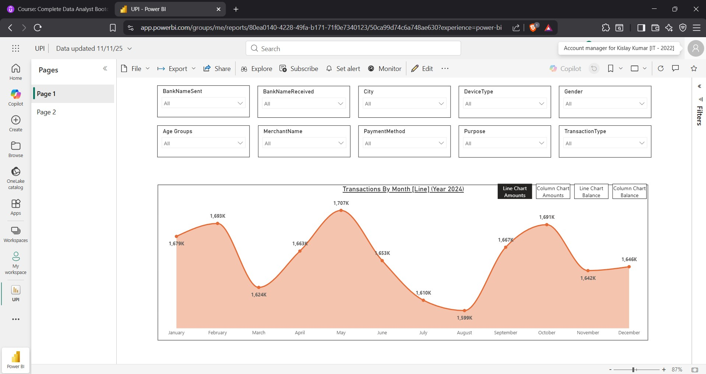
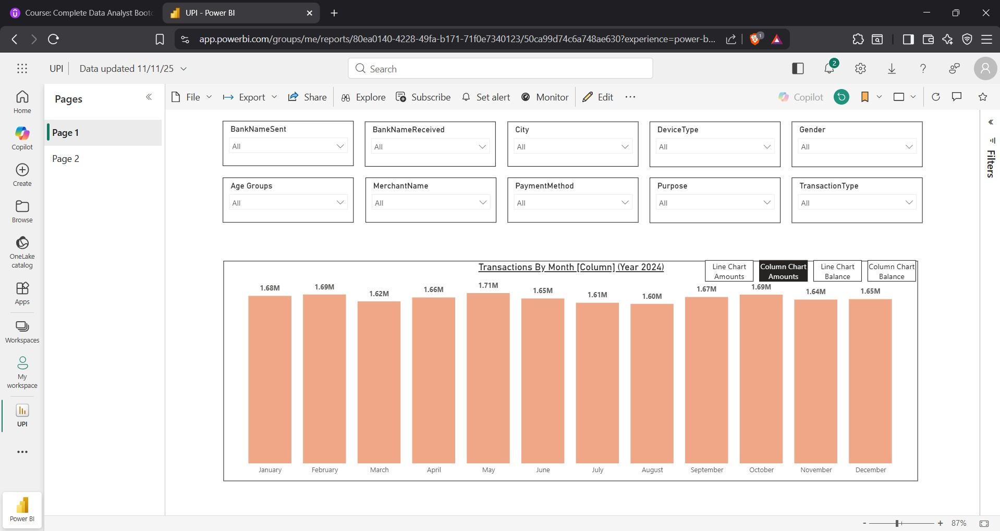
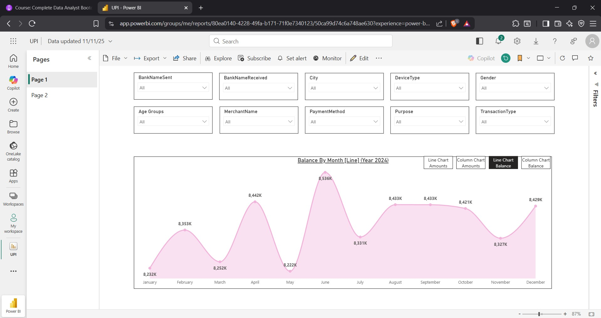
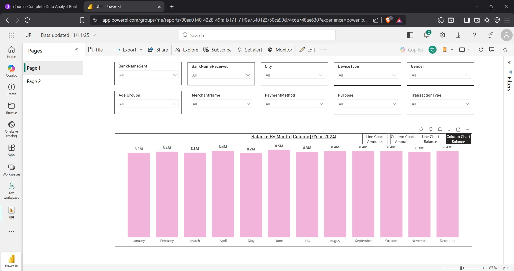
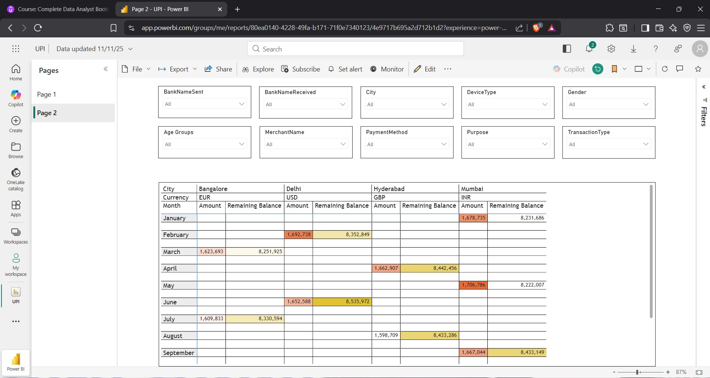

# UPI Transactions Data Analysis Dashboard (Power BI)

### Dashboard Link : https://app.powerbi.com/groups/me/reports/80ea0140-4228-49fa-b171-71f0e7340123/50ca99d74c6a748ae630?experience=power-bi&bookmarkGuid=eaf90bcf9b6818812f1a

This project is a Power BI Dashboard created for analyzing **UPI Transaction trends** across different cities, banks, merchant categories, payment methods, age groups, and user demographics.  
It provides a clear month-wise understanding of **Transaction Amounts** and **Remaining Balance** for the year 2024.

---

##  Key Features

- **Interactive Slicers** for:
  - Bank Name (Sent / Received)
  - City
  - Device Type
  - Gender
  - Age Groups
  - Merchant Name
  - Payment Method
  - Purpose
  - Transaction Type

- **Line Charts** for month-wise trend visualization
- **Column Charts** for monthly comparison
- **Data Matrix** for city & currency-wise breakdown
- **Conditional Formatting** to highlight high & low values
- **Bookmarks** to toggle views (Line ↔ Column Charts)
- **Sync Slicers** across report pages
- **Clean Data Profiling & Transformation**

---

##  Dashboard Snapshots

### 1. Transactions by Month – Line Chart

### 2. Transactions by Month – Column Chart

### 3. Balance by Month – Line Chart

### 4. Balance by Month – Column Chart

### 5. City-wise Currency Matrix with Conditional Formatting

---

##  Project Files

---

##  Tools Used

| Tool | Purpose |
|------|---------|
| **Power BI** | Visual analytics and dashboard design |
| **Power Query** | Data cleaning and modeling |
| **Excel / CSV** | Source dataset |

---

## Insights Provided

- Trend analysis of UPI usage throughout the year
- Month-to-month balance behavior
- Currency-wise transaction comparison across major cities
- Impact of demographics and devices on UPI usage
- Merchant & payment method performance trends

---

## ⭐ Conclusion

This dashboard provides a complete analytical view of UPI transactions, enabling businesses and analysts to make meaningful data-driven decisions.

If you found this helpful, **please give the repository a ⭐ on GitHub.**  
Feel free to fork and improve!

